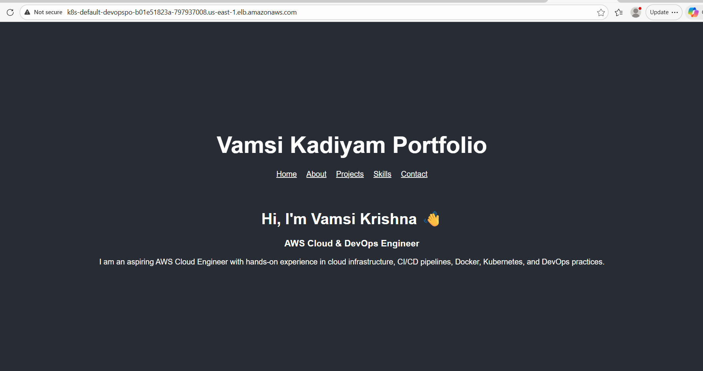

# DevOps Portfolio Project

This repository contains a full DevOps project demonstrating a CI/CD pipeline for deploying a Dockerized application to AWS EKS with Terraform, ALB Ingress Controller, ECR, and GitHub Actions.

# Prerequisites

Before starting, ensure you have the following:

AWS CLI configured with appropriate IAM permissions

kubectl installed

eksctl installed (for IAM service accounts and cluster management)

helm installed (for deploying ALB controller)

Terraform installed

GitHub repository connected for CI/CD

Start with Terraform Create main.tf 

# Deploy Terraform

```bash

terraform init

terraform plan

terraform apply -auto-approve

```

# Kubernetes Resources

Create a folder k8s/ at the root of the project:

```bash

mkdir k8s

```

In this folder just create deployment and service and ingress.yml files

Ingress Controller Setup

Install the AWS Load Balancer Controller on your EKS cluster:

Associate an IAM OIDC provider with your cluster (required for service account IAM roles):

```bash

eksctl utils associate-iam-oidc-provider \
  --cluster devops-portfolio-eks \
  --region us-east-1 \
  --approve

```

# Create IAM policy for the Load Balancer Controller:

```bash

aws iam create-policy \
  --policy-name AWSLoadBalancerControllerIAMPolicy \
  --policy-document file://iam_policy.json

```

# Create IAM service account in Kubernetes:

```bash

eksctl create iamserviceaccount \
  --cluster devops-portfolio-eks \
  --namespace kube-system \
  --name aws-load-balancer-controller \
  --attach-policy-arn arn:aws:iam::596660701410:policy/AWSLoadBalancerControllerIAMPolicy \
  --approve \
  --override-existing-serviceaccounts \
  --region us-east-1

```

# Install the AWS Load Balancer Controller via Helm:

```bash

helm repo add eks https://aws.github.io/eks-charts
helm repo update

```

```bash

helm install aws-load-balancer-controller eks/aws-load-balancer-controller \
  --namespace kube-system \
  --set clusterName=devops-portfolio-eks \
  --set serviceAccount.create=false \
  --set serviceAccount.name=aws-load-balancer-controller

```

Verify the ALB controller pods are running:

```bash

kubectl get pods -n kube-system | grep aws-load-balancer-controller

```

# ECR Repository Setup

Create an ECR repository:

```bash

aws ecr create-repository --repository-name devops-portfolio

```

# Terraform EKS Cluster

Create a main.tf for EKS cluster and node group.

Initialize and apply Terraform:

```bash

terraform init

terraform apply -auto-approve

```

Output example after creation:

eks_cluster_endpoint = "https://66E645B950D969E509F59C96592BFEDF.gr7.us-east-1.eks.amazonaws.com"

eks_cluster_name     = "devops-portfolio-eks"


# Update kubeconfig:

```bash

aws eks update-kubeconfig --name devops-portfolio-eks --region us-east-1

```

# Verify ALB Controller

```bash

kubectl get pods -n kube-system | grep aws-load-balancer-controller
kubectl describe sa aws-load-balancer-controller -n kube-system
kubectl logs -n kube-system <alb-pod-name>

```

# Kubernetes Deployment &

```bash

kubectl apply -f k8s/deployment.yaml
kubectl apply -f k8s/service.yaml
kubectl get pods
kubectl get svc
kubectl get endpoints

```

# Kubernetes Ingress 

```bash

kubectl apply -f k8s/ingress.yaml
kubectl get ingress
kubectl describe ingress <ingress-name>

```

# Troubleshooting

```bash

kubectl get events -n kube-system
kubectl describe pod <pod-name> -n kube-system
kubectl logs <pod-name> -n kube-system

```

# Prometheus & Grafana Installation on Kubernetes:

# Add Prometheus Community Helm repo

```bash

helm repo add prometheus-community https://prometheus-community.github.io/helm-charts

```

# Add Grafana Helm repo (optional if using kube-prometheus-stack)

```

helm repo add grafana https://grafana.github.io/helm-charts

```

# Update repos

```

helm repo update

```


# Install Prometheus & Grafana via kube-prometheus-stack

The kube-prometheus-stack chart installs Prometheus, Alertmanager, Node Exporter, and Grafana all together.

```bash

helm install monitoring-stack prometheus-community/kube-prometheus-stack \
  --namespace monitoring --create-namespace

```

# Check the installed services:

```bash

kubectl get svc -n monitoring
kubectl get pods -n monitoring

```

# Using NodePort

Patch the service to NodePort:

```bash

kubectl patch svc monitoring-stack-grafana -n monitoring -p '{"spec": {"type": "NodePort"}}'
kubectl patch svc monitoring-stack-kube-prom-prometheus -n monitoring -p '{"spec": {"type": "NodePort"}}'

```

Get the NodePort:

```bash

kubectl get svc -n monitoring

```

# Access Grafana: http://<Node-IP>:<NodePort>

# Access Prometheus: http://<Node-IP>:<NodePort>



